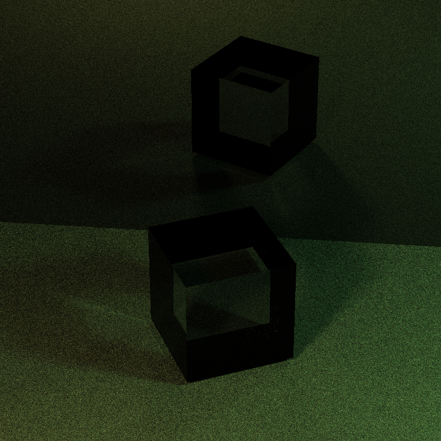
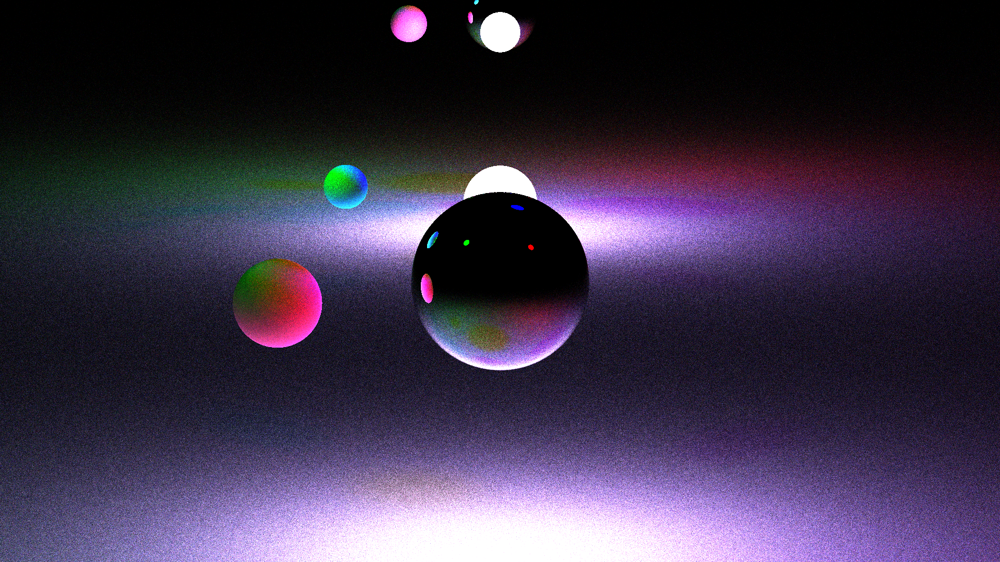

# Easy-Ray-Tracing-Render

## A c++ based ray-tracing render program

The aim of this project is to creat a program able to render a scene with 3D objects using a ray tracing algorithm.

## Content of the library

3 tipes of rendering engine:

* `rend_term` a real time terminal engine (only in black and white)
* `rend_img` a direct light only engine (fast but unaccurate)
* `rend_img_p` an ambient light sampling engine (complete render enginge with Montecarlo integration)

2 tipes of light:

* `l_point` (a spheric light source)
* `sun` (ambient light from given direction)

2 tipes of object:

* `sphere`
* `plane`

## How to use

Download the `ERTR` directory and run `make` then execute `build/ertr`

An example program is given in the `main.cpp` file.\
You can edit that or integrate the library in your software coping the 3 folders (`GMath`, `lodepng` and `rend`) and including the `rend.h` library.

In order to use the library:

* create a camera object `camera(double lx,double ly,double df)` where lx-ly are the sizes of the camera screen and df is the focal distance
* create a move function function `void move(camera& cam, vector<object*>& obj, vector<light*>& lig, double n)` that will be the function that iterate the movement of the objects of the scene at each frame
* create a scene object `scene(camera c, (*move) m)`
* create objects and lights of the available classes and add theme to the scene with the methods of the scene class `add_obj(object& o)` and `add_lig(light& l)`
* render the scene with one of the available engine using the respective method of the scene class

All the entities (camera, objects and lights) have movement and rotation methods that can be used to animate the scene in the movement function

